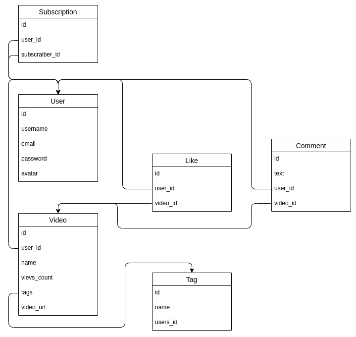
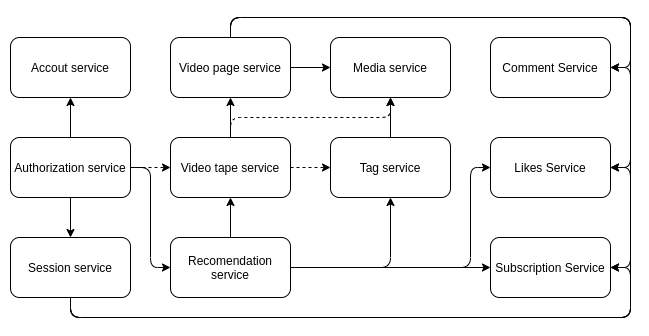

# Highload
homework №2

### 1. Выбор темы
* Сервис (Tiktok) для использования на территории Индии

### 2. Определение возможного диапазона нагрузок
* Tiktok ориентируется на мобильных пользователей, для этого расчитаем общее 
  число пользователей использующий мобильный интернет в Индии.
  
  * Общее число пользователей интернет в Индии на 2020 ~(650 000 000). Пруфы:
    [1.](https://www.cia.gov/library/publications/the-world-factbook/fields/204rank.html#AQ)
    [2.](https://www.internetlivestats.com/internet-users/india/)
    [3.](https://www.statista.com/statistics/255146/number-of-internet-users-in-india/)
	
  * Число пользователей, использующих мобильный интернет в Индии на 2020 составляет ~70% 
    от общего числа пользователей сети интернет в Индии ~(450 000 000). Пруфы:
    [1.](https://www.statista.com/statistics/558610/number-of-mobile-internet-user-in-india/)
    [2.](https://ourworldindata.org/internet)
	
* Число пользователей ~(450 000 000) является максимальной оценкой рынка для любого мобильного приложения в Индии.
  В этом числе не учитывается распределение целевой аудитории. Можно предположить, целивая аудитория Tiktok в 
  Индии раполагается в интервале от 18 до 44 лет. Для числинной оцеки объективной аудитории найдём распределение 
  пользователей сети интернет в мире по возрастным группам и предположим, что для Индии в среднем этот показатель идентичен.

  * Распределение пользователей сети интернет в мире по возрастным группам. Пруфы:
    [1.](https://www.statista.com/statistics/272365/age-distribution-of-internet-users-worldwide/)
    [2.](https://sproutsocial.com/insights/new-social-media-demographics/)
    [3.](https://telesputnik.ru/materials/trends/news/auditoriya-tiktok-v-rossii-dostigla-20-2-mln-polzovateley/)

    | Age range | Percent |
    | ----------|-------: |
    |  18 - 24  |  ~ 18%  |
    |  25 - 34  |  ~ 32%  |
    |  35 - 44  |  ~ 19%  |
    |  45 - 54  |  ~ 14%  |
    |  55 - 64  |  ~ 10%  |
    |  65 +     |  ~ 7%   |

* Заметим, что целевая аудитория составляет около 70% от общего кол-ва пользователей,
  использующих мобильный интернет в Индии. И соответственно это число можно оценить в ~(315 000 000)

### 3. Выбор планируемой нагрузки
* Положим среднюю нагрузку равной 40% от оцененной целевой аудитории ~(120 000 000) Пруфы: [1.](https://blog.hootsuite.com/what-is-tiktok/)

* В среднем активные пользователи тикток проводят 60 минут в приложении один за день. Пруфы: [1.](https://www.businessofapps.com/data/tik-tok-statistics/) [2.](https://www.oberlo.com/blog/tik-tok-statistics) 
[3.](https://www.theverge.com/interface/2020/6/10/21285309/tiktok-2020-user-numbers-revenue-smash-hit-mea-culpa )

* За 10 минут пользования сайтом, было использовано 230MB трафика и было сделанно 519 запросов.

	|                   |  Трафик | Колличество запросов |
	|-------------------|---------|----------------------|
	| Статика медиа     |  220 MB |          86          |
	| Остальная статика |  9 MB   |          209         |
	| Динамика          |  850 KB |          124         |

* За сутки пользования сервисом в среднем пользователем будет израсходованно:

	|                   | Трафик  | Колличество запросов |
	|-------------------|---------|----------------------|
	| Статика медиа     | 1320 MB |         516          |
	| Остальная статика | 54 MB   |         1254         |
	| Динамика          | 6 MB    |         744          |

* Пруфы: [1.](1.1.png) [2.](2.2.png) [3.](3.3.png)

* Расчитаем средний трафик для динамики и статики:
	* Динамика: (6MB * 120 000 000) / (24 * 60 * 60) * 8 = 65 Gbit/S
	* Статика медиа: (1320MB * 120 000 000) / (24 * 60 * 60) * 8 = 14 Tbit/S
	* Остальная статика: (54MB * 120 000 000) / (24 * 60 * 60) * 8 = 0.6 Tbit/S
	
* Расчитаем средний RPS для динамики и статики:
	* Динамика: (744 * 120 000 000) / (24 * 60 * 60) = 1 000 000 RPS
	* Статика медиа: (516 * 120 000 000) / (24 * 60 * 60) = 750 000 RPS
	* Остальная статика: (1254 * 120 000 000) / (24 * 60 * 60) = 1 800 000 RPS
	
* Итог:	

	|                   |   Трафик   |    RPS    |
	|-------------------|------------|---------- |
	| Статика медиа     | 14 Tbit/S  | 750 000   |
	| Остальная статика | 0.6 Tbit/S | 1 800 000 |
	| Динамика          | 65 Gbit/S  | 1 000 000 |
	
* Отдельно стоит учитывать, что нагрузка распределенна не равномерно, её распределение зависит от времени суток. Из проведённого исследования [1.](http://ceur-ws.org/Vol-2353/paper71.pdf) можно гурбо оценить, что ночная нагрузка меньше средней нагрузки в ~2 раза, а дневная больше средней в ~3 раза.  

### 4. Логическая схема базы данных
* Выделим основные сущности в нашем проекте: пользователь, видео, подписка, лайк, тег и коментарий. На рисунке отображены поля моделей и заданы отношения между каждой из моделей. 

* Выделим ключи шардирования для таблиц:

	| Название таблицы | Ключ шардирования |
	|------------------|-------------------|
	| Подписки         | user id           |
	| Лайки            | user id           |
	| User             | user id           |
	| Коментарии       | video id          |
	| Теги             | id                |

* Выделим основные сервисы приложения:

### 5. Физическая системы хранения
* Рассмотрим сервисы приложения и выделим характеристики физических систем хранения:
	* Account service - Хранит данные пользователя. Среднее чтение, средняя запись, хранение "холодных данных", повышенные требования к сохранности информации.
	
	* Autorization service - Авторизует пользователя. Не большой объём данных. Частое чтение, частая запись, хранение "горячих данных".
	
	* Session service - Возвращяет id пользователя, по его сесии. Не большой объём данных. Частое чтение, частая запись, хранение "горячих данных".
	
	* Likes Service - Позволяет пользователю ставить лайки. Не большой объём данных. Частое чтение, частая запись, хранение "горячих и холодных" данных. Конкурентный доступ
	
	* Subscription Service - Позволяет пользователю подписываться на авторов. Не большой объём данных. среднее чтение, редкая запись, хранение "горячих и холодных" данных.
	
	* Comment Service - Позволяет пользователю оставлять коментарии к видео. Хороший объём данных. среднее чтение, редкая запись, хранение "горячих и холодных" данных.
	
	* Tag service - Позволяет получать группы видео по тегам. Хороший объём данных. Частое чтение, частая запись, хранение "горячих" данных.
	
	* Media service - Позволяет загрузить конкретное видео. Большой объём хранимой информации, частое чтение, редкая запись

* Для хранения большого объёма медиа данных лучше всего использовать файловую систему, так как не требуется корректная обработка конкурентного изменения данных. Преимуществом такого подхода является его относительно лёгкое расширение на большое колличество физических серверов.

* Для хранения данных пользователя, коментариев и тегов будем использовать Postgress. По сравнению с другими реалиционными базами данных он имеет, поддержку баз данных неограниченного размера, мощные и надёжные механизмы транзакций и репликации. Имеет хорошую производительность при аналитических запросах. В отличае от медиа данных, эти данные имеют не очень большой объём, а так же раскиданны по разным сервисам, что позволяет эффективно использовать шардинг баз между серверами в сервисе.

* Для хранения активных сессий пользователя, лайков и подписок будем использовать Redis + Memcached с записью "холодных" данных на диск.

### 6. Выбор прочих технологий
* Языки программирования
	* Backend - Golang, C ++. Преимущества этих языков состоит в: 
		* Большом рынке программистов
		* Поддержке параллельных вычислений
		* Компилируемости
		* Статической типизации
		* Хорошей документационной базе

	* Frontend - Css, HTML , JavaScript, TypeScript, React , Sass, Webpack. 
		*React, обеспечивает модульность, быстрый рендеринг, высокую run-time производительность, работает с virtual DOM.

* Протоколы взаимодействия
	* Протокол связи между фронтендом и бэкендом - https, данные будут передаваться в формате json.

* Общение между микросервисами на бэкенде будет осуществляться по протоколу gRPC, данные будут передаваться в формате protobuf.

### 7. Расчет нагрузки и потребного оборудования
* Балансировщики, терминация SSL и раздачача статики (без медиа статики)

	* Для балансировки и терминации трафика будем использовать сервера с nginx.  
		
	* Сумарный RPS на фронтенд и бекенд для "лёгких запросов" равен 1 000 000RPS + 1 800 000RPS = 2 800 000RPS, с учётом пиковых нагрузок получим 2 800 000RPS * 3 = 8 400 000RPS.
		
	* Рассчитаем колличество машин для балансировки и терминации SSL трафика для лёгких запросов. Исходя из размера пакета в 100KB и из документации nginx [1.](https://www.nginx.com/blog/testing-the-performance-of-nginx-and-nginx-plus-web-servers/) 
[2.](https://www.nginx.com/blog/nginx-websockets-performance/), можно сделать вывод, что для балансировки, терминации ssl и раздачи статики ~ 8 400 000RPS понадобится 8 400 000RPS / 90 000RPS = 100 серверов конфигурации:

		|          CPU          |  Memory |   SSD   |
		|-----------------------|---------|---------|
		|  2x Intel(R) 36 cores |  16 GB  |  128GB  |
	
* Медиа статика
	
	* Для отдачи статики будем использовать сервера с nginx.
		
	* Определим необходимый объём хранилища медиа данных. Из статей [1.](https://www.oberlo.com/blog/tiktok-statistics) [2.](https://www.businessofapps.com/data/tik-tok-statistics/) [3.](https://influencermarketinghub.com/tiktok-stats/) можно сделать вывод, что пользователи будут загружать около 1 000 000 видео ежедневно, а также опираясь на то, что максимальный объём видео tictok составляет 75MB оценим объём данных с запасом на 5 лет 360 * 1 000 000 * 75 = 26PB.
		
	* Учитывая, что средняя скорость чтения с SSD диска ~700Mbit, то для покрытия нагрузки в 14Tbit с запасом в 20%, то есть 14Tbit * 1.2 = 16.8Tbit потребуется 16.8Tbit / 700Mbit = 25 200 дисков. Если в каждый сервер вмещается 64 диска, то минимальное число серверов 25 200 / 64 = 394.
		
	* Определим необходимый объём диска для хранения 26PB данных, с учётом двойного запаса. 52PB / 394 / 64 = 2TB
		
	* Рассмотрим так же оставшиеся критерии (CPS и пропускную способность)  для сервера с конфигурацией:
	
		|          CPU         | Memory  |    SSD    |                Network               |
		|----------------------|---------|-----------|--------------------------------------|
		| 2x Intel(R) 36 cores | 256 GB  |  2TB x 64 | 2x Intel XL710 40 GbE QSFP+ (rev 01) |
			
	* Исходя из документации nginx [1.](https://www.nginx.com/blog/testing-the-performance-of-nginx-and-nginx-plus-web-servers/) 
[2.](https://www.nginx.com/blog/nginx-websockets-performance/) видно, что CPS для данного сервера ~10 000CPS. Тогда CPS для 394 серверов равен 394 * 10 000CPS = 3 940 000CPS > 750 000CPS, следовательно проблем с CPS нет. Пропускная способность для такого сервера ~50GBit, тогда общая пропускная способность 394 * 50Gbit = 19.2Tbit > 14Tbit * 1.2, следовательно с пропускной способностью всё в порядке. Таким образом получаем 394 сервера для отдачи медиа данных с сипользованием технологии RAID 10
	
* Сервис рекомендаций 
	
	* Для отдачи данных будем использовать сервера с nginx.
		
	* Оценим RPS рекомендательной системы. В среднем один человек в день просматривает 85 * 6 = 510 видео. Предположим, что каждые 5 видео отправляется запрос в рекомендательный сервис для генерации просматриваемой ленты. Получим 510 / 5 = 102 запроса. Учитывая 120 000 000 активных полльзователей получим средний RPS сервиса 120 000 000 * 102 / (24 * 60 * 60) = 150 000 RPS, с учётом пиковых нагрузок получим 150 000 RPS * 3 = 450 000 RPS
		
	* Будем считать, что для сложного аналитического вычисления на ядро приходится 200 RPS, тогда рассчитаем колличество серверов, исходя из того, что на сервере находится 32 ядра. 450 000 RPS / 32 / 200 = 71 сервер. 
		
	* Таким образом будет достаточно 71 машины с конфигурацией:
	
		|          CPU         |  Memory  |    SSD     |
		|----------------------|----------|------------|
		| 2x Intel(R) 32 cores |  128 GB  |   128 GB   |

* Сервис данных пользователя 
	
	* А качестве сервера будем использовать nginx.
		
	* Максимальный объём данных записи одного пользователя можно с запасом оценить в 128KB, таким образом на 480 000 000 пользователей, с учётом роста понадобится 58TB.
		
	* Оценим RPS сервис авторизации. Исходя из того, что человек в стреднем проводит в приложении около 60 минут в день, а его сессия длиться около 5 минут, можно предположить, что за день он совершит 12 обращений к сервису. Таким образом можно оценить средний RPS для сервиса авторизации 12 * 120 000 000 / (60 * 24 * 24) = 16 800 RPS с учётом пиковых нарузок получим 50 400 RPS.
		
	* Оценивая максимальную производительность базы данных в 1000RPS на ядро получим, что потребуется 5 - 6 серверов с 32 ядрами.
		
	* Рассчитаем обём дискового пространства серверов 58TB / 6 = 10TB
		
	* Таким образом исходя из документации nginx [1.](https://www.nginx.com/blog/testing-the-performance-of-nginx-and-nginx-plus-web-servers/) [2.](https://www.nginx.com/blog/nginx-websockets-performance/), что будет достаточно 6 машин. С учётом 1 master 2 slave получим 18 машин с конфигурацией:
		
		|          CPU         |  Memory  |    SSD     |
		|----------------------|----------|------------|
		| 2x Intel(R) 32 cores |  32 GB   | 512GB x 20 |

* Сервис коментариев
	
	* Для отдачи данных будем использовать сервера с nginx.
		
	* Предположим, что под каждым новым видео роликом пользователи оставляют в среднем 10 коментариев и исходя из того, что каждый день на сервис заливается около 1 000 000 новых видео, а размер коментария максимально оценивается в 10KB, расчитаем необходимый дисковый объём c запасом на 2 года 1 000 000 * 10 * 10KB * 365 * 2 = 67TB
		
	* Оценим аналогично средний RPS 1 000 000 * 10 / (24 * 60 * 60) = 200RPS, с учётом пиковых нагрузок получим 600RPS
		
	* Оценивая максимальную производительность базы данных в 500RPS на ядро получим, что потребуется 3 - 4 сервера с учётом "запаса".
		
	* Таким образом исходя из документации nginx [1.](https://www.nginx.com/blog/testing-the-performance-of-nginx-and-nginx-plus-web-servers/) [2.](https://www.nginx.com/blog/nginx-websockets-performance/), что будет достаточно 4 машины. С учётом 1 master 2 slave получим 12 машин с конфигурацией:
	
		|          CPU         |  Memory  |   SSD      |
		|----------------------|----------|------------|
		| 2x Intel(R) 32 cores |  16 GB   | 512GB x 32 |
		
* Сервис лайков
	
	* Для отдачи данных будем использовать сервера с nginx.
		
	* Предположим, что в среднем пользователь за день лайкает 50 видео исходя из того, что каждый день на сервис заливается около 1 000 000 новых видео, а размер лайка максимально оценивается в 64B, расчитаем необходимый дисковый объём c запасом на 2 года 1 000 000 * 50 * 64B * 365 * 2 = 2.2TB
		
	* Оценим аналогично средний RPS 1 000 000 * 50 / (24 * 60 * 60) = 600RPS, с учётом пиковых нагрузок получим 1800RPS. Так как сервис рекомендаций делает запросы к этому сервису получим: 1800RPS + 450 000RPS = 451 800 RPS при пиковой нагрузке.
		
	* Оценивая максимальную производительность redis базы данных в 30 000 RPS на ядро получим, что потребуется 15 серверов.
		
	* Оценим требуемый объём оперативной памяти для машины 2.2TB / 15 = 256GB с запасом.
		
	* Таким образом исходя из документации nginx [1.](https://www.nginx.com/blog/testing-the-performance-of-nginx-and-nginx-plus-web-servers/) [2.](https://www.nginx.com/blog/nginx-websockets-performance/), что будет достаточно 15 машин. С учётом 1 master 2 slave получим 45 машин с конфигурацией:
	
		|          CPU         |  Memory  |   SSD   |
		|----------------------|----------|---------|
		| 2x Intel(R) 32 cores |  256 GB  |  128GB  |
			
* Сервис тегов
	
	* Для отдачи данных будем использовать сервера с nginx.
		
	* Предположим, что в среднем пользователь за день делает поиск по тегам 50 раз, исходя из того, что каждый день на сервис заливается около 1 000 000 новых видео, а размер поля тега максимально оценивается в 128KB, расчитаем необходимый дисковый объём c запасом на 2 года 1 000 000 * 50 * 128KB * 365 * 2 = 4.3PB
		
	* Оценим аналогично средний RPS 1 000 000 * 50 / (24 * 60 * 60) = 600RPS, с учётом пиковых нагрузок получим 1800RPS. Так как сервис рекомендаций делает запросы к этому сервису получим: 1800RPS + 450 000RPS = 451 800 RPS при пиковой нагрузке.
		
	* Оценивая максимальную производительность базы данных в 500 RPS на ядро получим, что потребуется 451 800RPS / 32 / 500RPS = 30 серверов.
		
	* Оценим дисковый объём одной машины. 4.3PB / 30 = 147TB. Учитывая то, что в сервер максимально можно поставить около 64 дисков получим размер диска. 147TB / 64 = 4TB "с большим запасом при округлении в большую стророну".
		
	* Таким образом исходя из документации nginx [1.](https://www.nginx.com/blog/testing-the-performance-of-nginx-and-nginx-plus-web-servers/) [2.](https://www.nginx.com/blog/nginx-websockets-performance/), что будет достаточно 30 машин. С учётом 1 master 2 slave получим 90 машин с конфигурацией:
	
		|          CPU         |  Memory  |   SSD    |
		|----------------------|----------|----------|
		| 2x Intel(R) 32 cores |  32 GB   | 4TB x 64 |
		
* Сервис авторизации
	
	* Для отдачи данных будем использовать сервера с nginx.
		
	* Используется для работы с "горячими данными пользователя", которые берутся из сервиса данных пользователя и хранятся в redis. Одну запись "пару" ключ-значение можно оценить в 64B. Учитывая то, что пользователь в среднем 12 раз за день авторизуется в сервисе получим, 64B * 120 000 000 = 8GB.
		
	* RPS так же можно оценить в 12 * 120 000 000 / (24 * 60 * 60) = 17 000RPS, с учётом пиковых нагрузок получим 17 000RPS * 3 = 51 000 RPS

	* Оценивая средний RPS на ядро для redis в 10 000RPS получим одну машину, которой будет достаточно, для отказоустойчивости возьмём сумарно 6 машин. С учётом 1 master 2 slave получим 18 машин с конфигурацией:
	
		|          CPU         |  Memory  |    SSD   |
		|----------------------|----------|----------|
		| 2x Intel(R) 32 cores |  32 GB   |   128GB  |
		
* Сервис сессий
	
	* Для отдачи данных будем использовать сервера с nginx.
		
	* Сессия проверяется при любом запросе на создание лайков, коментариев, подписок, авторизации, добавления видео а так же сервис рекомендаций. RPS данного сервиса можно оценить из предыдущих пунктов 1800RPS + 1800RPS + 600RPS + 51 000 RPS + 11RPS + 450 000RPS = 460 000 RPS, с учётом пиковых нагрузок.
		
	* Размер одной key:value пары для redis можно оценить в 128B. Для 120 000 000 пользователей с 4х кратным запасом получим 120 000 000 * 4 * 128B = 57GB		
	* Оценивая максимальную производительность redis базы данных в 10 000 RPS на ядро получим, что потребуется 460 000RPS / 32 / 10 000RPS = 1 видим, что будет достаточно 1 сервера, но для отказоустойчивости вырём в 6 раз больше, потому, что это тонкое место всего проекта. Получаем 6 серверов. С учётом 1 master 2 slave получим 18 машин с конфигурацией:
	
		|          CPU         |  Memory  |   SSD    |
		|----------------------|----------|----------|
		| 2x Intel(R) 32 cores |  32 GB   | 128GB    |
			
			
* Итог
	
	| Балансировка и раздача статики   |          CPU         |  Memory  |   SSD    | Кол-во | Cумма |
	|----------------------------------|----------------------|----------|----------|--------|-------|
	| Остальная статика и балансировка | 2x Intel(R) 32 cores |  16GB    | 128GB    |  100   |       |
	| Медиа статика                    | 2x Intel(R) 32 cores |  256GB   | 2TB x 64 |  394   |  494  |
		
	|    Бэкенд           |          CPU         |  Memory  |    SSD     | Кол-во | Cумма |
	|---------------------|----------------------|----------|------------|--------|-------|
	| Рекомендации        | 2x Intel(R) 32 cores |  128GB   | 128GB      |   71   |       |
	| Данные пользователя | 2x Intel(R) 32 cores |  32GB    | 512GB x 20 |   18   |       | 
	| Коментарии	      | 2x Intel(R) 32 cores |  16GB    | 512GB x 32 |   12   |       | 
	| Лайки	              | 2x Intel(R) 32 cores |  256GB   | 128GB      |   45   |       | 
	| Теги                | 2x Intel(R) 32 cores |  32GB    | 4TB x 64   |   90   |       | 
	| Аторизация          | 2x Intel(R) 32 cores |  32GB    | 128GB      |   18   |       | 
	| Сессии              | 2x Intel(R) 32 cores |  32GB    | 128GB      |   18   |  272  | 
		
	|	                         | Кол-во | Cумма |
	|--------------------------------|--------|-------|
	| Балансировка и раздача статики |  494   |       |
	| Бэкенд                         |  272   |  766  |
	
### 8. Выбор хостинга / облачного провайдера и расположения серверов
* Расчитаем стоимость использования облачного сервиса Amazon Web Services. [1.](https://aws.amazon.com/ru/about-aws/global-infrastructure/)
	
	* Для этого возьмем сервера в дата-центраx Мумбаи с 3 зонами доступности. [2.](https://aws.amazon.com/ru/about-aws/global-infrastructure/regions_az/) [3.](https://aws.amazon.com/cloudfront/features/)
	
	* Произведём расчёт стоимости, опираясь на [1.](https://aws.amazon.com/ru/ec2/pricing/on-demand/) и [2.](https://aws.amazon.com/ru/ebs/pricing/). При расчёте, при отсутствии требуемой конфигурации бралась ближайшая по аппаратной конфигурации.

	| Балансировка и раздача ститики   |          CPU         |  Memory  |   SSD    | Кол-во |     Стоимость      |  Стоимость EBS   | Cумма     | Итог      |
	|----------------------------------|----------------------|----------|----------|--------|--------------------|------------------|-----------|-----------|
	| Остальная статика и балансировка | 2x Intel(R) 32 cores |  16GB    |  128GB   |  100   | 0,6816 USD/h х 100 | 0,02 USD/h x 100 |71 USD/h   |           |
	| Медиа статика 	           | 2x Intel(R) 32 cores |  256GB   | 2TB x 64 |  394   | 1,144 USD/h х 394  | 20,4 USD/h x 394 |7518 USD/h |7589 USD/h |
		
	| Бэкенд              |          CPU         |  Memory  |    SSD     | Кол-во |      Стоимость     | Стоимость EBS    | Cумма      | Итог         |
	|---------------------|----------------------|----------|------------|--------|--------------------|------------------|------------|--------------|
	| Рекомендации        | 2x Intel(R) 32 cores |  128GB   | 128GB      |   71   | 0,889 USD/h  x 71  | 0,02 USD/h x 71  | 65 USD/h   |              |
	| Данные пользователя | 2x Intel(R) 32 cores |  32GB    | 512GB x 20 |   18   | 0,6816 USD/h х 18  | 1,6 USD/h x 18   | 41 USD/h   |              |
	| Коментарии          | 2x Intel(R) 32 cores |  16GB    | 512GB x 32 |   12   | 0,6816 USD/h х 12  | 2,6 USD/h x 12   | 39,4 USD/h |              |
	| Лайки               | 2x Intel(R) 32 cores |  256GB   | 128GB      |   45   | 1,04 USD/h   x 45  | 0,02 USD/h x 45  | 48 USD/h   |              |
	| Теги                | 2x Intel(R) 32 cores |  32GB    | 4TB x 64   |   90   | 0,6816 USD/h х 90  | 40,94 USD/h x 90 | 3746 USD/h |              |
	| Авторизация         | 2x Intel(R) 32 cores |  32GB    | 128GB      |   18   | 0,6816 USD/h х 18  | 0,02 USD/h x 18  | 12,7 USD/h |              |
	| Сессии              | 2x Intel(R) 32 cores |  32GB    | 128GB      |   18   | 0,6816 USD/h х 18  | 0,02 USD/h x 18  | 12,7 USD/h | 3964,8 USD/h |
		
	|	                         | Сумма        | Итог        |
	|--------------------------------|--------------|-------------|
	| Балансировка и раздача статики | 7589 USD/h   |             |
	| Бэкенд                         | 3964,8 USD/h | 11554 USD/h |
	
	11554 USD/h * 24 * 30 = 8 318 880 USD/m

* Примерно расчитаем стоимость железа:

	|	        | Стоимость        | Сумма         | Итог          |
	|---------------|------------------|---------------|---------------|
	| SSD 128GB     | 18 USD x 252     | 4 536 USD     |               |
	| SSD 512GB     | 53 USD x 744     | 39 432 USD    |               |
	| SSD 2TB       | 160 USD x 25 216 | 4 034 560 USD |               |
	| SSD 4TB       | 430 USD x 5760   | 2 476 800 USD | 6 555 328 USD |
	
	|	                          | Стоимость       | Итог          |
	|---------------------------------|-----------------|---------------|
	| 2 x Intel(R) Xeon(R) v3 36 core | 2616 USD x 766  | 2 003 856 USD |

	|	        | Стоимость       | Сумма       | Итог          |
	|---------------|-----------------|-------------|---------------|
	| RAM 16GB      | 60 USD x 112    | 6 720 USD   |               |
	| RAM 32GB      | 208 USD x 144   | 29 952 USD  |               |
	| RAM 128GB     | 832 USD x 71    | 59 072 USD  |               |
	| RAM 256GB     | 1664 USD x 439  | 730 496 USD | 826 240 USD   |
	
	|	        | Сумма         | Итог           |
	|---------------|---------------|----------------|
	| SSD           | 6 555 328 USD |                |
	| Processors    | 2 003 856 USD |                |
	| RAM           | 826 240 USD   | 9 385 424 USD  |
	
* Оценим стоимость датацентра:

	* Исходя из статьи [1.](https://skladium.ru/rynok/datacenters-rynok-rastet-spros-uvelichivaetsya) получим ~20 000 USD на 10 стоек. Расчитаем очень грубо стоимость датацентра 1833 / 10 * 20 000 USD = 3 666 000 USD
	
* Оценим время окупаемости собственных серверов и датацентров:
	(9 385 424 USD + 3 666 000 USD) / 8 318 880 USD/m = 1.6m
	
* Выводы:
	На много дешевле разместить свои датацентры.

### 9. Схема балансировки нагрузки (входящего трафика и внутрипроектного, терминация SSL)

* Для балансировки нагрузки между датацентрами будем использовать Round Robin DNS.

* Запросы не связанные с раздачей медиа статики будем балансировать с помощью nginx с использованием схемы L7. Nginx имеет внутренние инструменты для настройки SSL терминации. Использование nginx позволит равномерно распределить нагрузку и решит проблемы медленных клиентов. 

* Для отдачи медиа статики nginx будет перенапрявлять пользователя непосредственно на сервер, раздающий видео, такой подход поможет значительно уменьшить исходящий трафик, проходящий через балансировщки.

### 10. Обеспечение отказоустойчивости

* Использование собственных серверов с 3-мя зонами доступности ).

* Использование микросервисной архитектуры

* Использование master-slave репликации

* Использоваине технологии RAID 10 для хранения данных пользователей и медиа информации
	* Эффективная ёмкось S * N / 2
	* Допустимое количество вышедших из строя дисков от 1 до N/2 дисков. Информация не потеряется, если выйдут из строя диски в пределах разных зеркал.
	* Надёжность / скорость чтения / скорость записи - (высокая / высокая / высокая)
