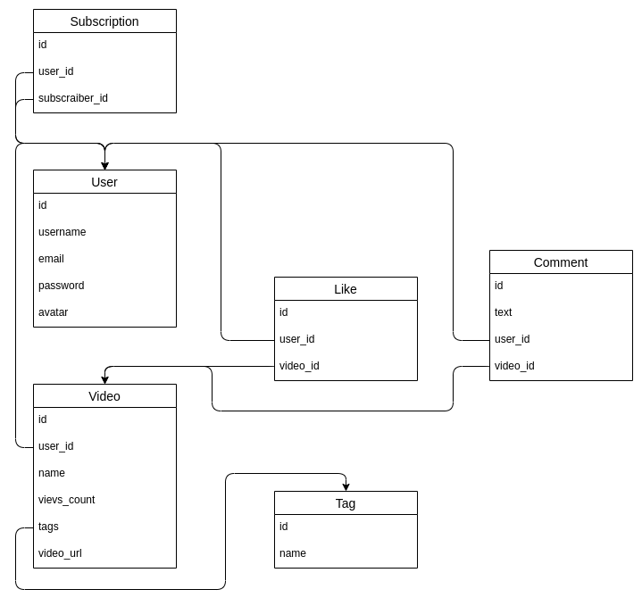

# Highload
homework №2

### 1. Выбор темы
* Сервис (Tiktok) для использования на территории Индии

### 2. Определение возможного диапазона нагрузок
* Tiktok ориентируется на мобильных пользователей, для этого расчитаем общее 
  число пользователей использующий мобильный интернет в Индии.
  
  * Общее число пользователей интернет в Индии на 2020 ~(650 000 000). Пруфы:
    [1.](https://www.cia.gov/library/publications/the-world-factbook/fields/204rank.html#AQ)
    [2.](https://www.internetlivestats.com/internet-users/india/)
    [3.](https://www.statista.com/statistics/255146/number-of-internet-users-in-india/)
	
  * Число пользователей, использующих мобильный интернет в Индии на 2020 составляет ~70% 
    от общего числа пользователей сети интернет в Индии ~(450 000 000). Пруфы:
    [1.](https://www.statista.com/statistics/558610/number-of-mobile-internet-user-in-india/)
    [2.](https://ourworldindata.org/internet)
	
* Число пользователей ~(450 000 000) является максимальной оценкой рынка для любого мобильного приложения в Индии.
  В этом числе не учитывается распределение целевой аудитории. Можно предположить, целивая аудитория Tiktok в 
  Индии раполагается в интервале от 18 до 44 лет. Для числинной оцеки объективной аудитории найдём распределение 
  пользователей сети интернет в мире по возрастным группам и предположим, что для Индии в среднем этот показатель идентичен.

  * Распределение пользователей сети интернет в мире по возрастным группам. Пруфы:
    [1.](https://www.statista.com/statistics/272365/age-distribution-of-internet-users-worldwide/)
    [2.](https://sproutsocial.com/insights/new-social-media-demographics/)
    [3.](https://telesputnik.ru/materials/trends/news/auditoriya-tiktok-v-rossii-dostigla-20-2-mln-polzovateley/)

    | Age range | Percent |
    | ----------|-------: |
    |  18 - 24  |  ~ 18%  |
    |  25 - 34  |  ~ 32%  |
    |  35 - 44  |  ~ 19%  |
    |  45 - 54  |  ~ 14%  |
    |  55 - 64  |  ~ 10%  |
    |  65 +     |  ~ 7%   |

* Заметим, что целевая аудитория составляет около 70% от общего кол-ва пользователей,
  использующих мобильный интернет в Индии. И соответственно это число можно оценить в ~(315 000 000)

### 3. Выбор планируемой нагрузки
* Положим среднюю нагрузку равной 40% от оцененной целевой аудитории ~(120 000 000) [тык](https://blog.hootsuite.com/what-is-tiktok/)

### 4. Логическая схема базы данных
* Выделим основные сущности в нашем проекте: пользователь, видео, подписка, лайк, тег и коментарий. На рисунке отображены поля моделей и заданы отношения между каждой из моделей. 

### 5. Физическая системы хранения
### 6. Выбор прочих технологий
* Языки программирования
	* Backend - Golang, C, C ++, Java. Преимущества этих языков состоит в: 
		* Большом рынке программистов
		* Поддержке параллельных вычислений
		* Компилируемости
		* Статической типизации
		* Хорошей документационной базе

	* Frontend - Css, HTML , JavaScript, TypeScript, React , Sass, Webpack. 
		*React, обеспечивает модульность, быстрый рендеринг, высокую run-time производительность, работает с virtual DOM.

* Протоколы взаимодействия
	* Протокол связи между фронтендом и бэкендом - https, данные будут передаваться в формате json.

* Общение между микросервисами на бэкенде будет осуществляться по протоколу gRPC, данные будут передаваться в формате protobuf.

### 7. Расчет нагрузки и потребного оборудования
### 8. Выбор хостинга / облачного провайдера и расположения серверов
### 9. Схема балансировки нагрузки (входящего трафика и внутрипроектного, терминация SSL)
### 10. Обеспечение отказоустойчивости
